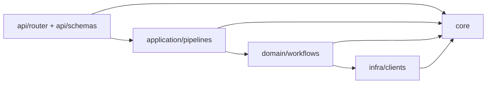

# AgentFlow 接手技能（面向未来 AI 助手）

## 0. 先看这几个入口
- HTTP 入口与生命周期: `app/main.py`
- 后台任务入口: `app/worker.py`
- 工作流装配: `app/core/graph_bootstrap.py`
- RAG 工作流: `app/domain/workflows/adaptive_rag/`
- PDF 结构化工作流: `app/domain/workflows/pdf_structured/`

## 1. 核心技术栈与分层约定

### 1.1 技术栈（以 `pyproject.toml` 为准）
- Web: FastAPI + Uvicorn
- 队列: arq + Redis
- 编排: LangGraph
- 模型层: LangChain (`init_chat_model`) + Ollama
- 向量库: Chroma (`langchain-chroma`)
- 数据校验: Pydantic v2
- 文档处理: pypdf
- 外部调用: httpx

### 1.2 分层职责（不要跨层写逻辑）
- `app/api/router/*`: 只做协议适配与任务提交/查询。
    - 例: `rag_router.py` 只 enqueue 任务并读 LangGraph 快照。
    - 例: `pdf_router.py` 只组装上传文件 payload。
- `app/api/schemas/*`: API 入参与返回模型，面向 HTTP 契约。
- `app/application/pipelines/*`: 任务级编排，负责 payload 校验、state 组装、调用 graph。
- `app/domain/workflows/*`: 领域图与节点逻辑。
    - `state.py`: LangGraph TypedDict 契约。
    - `graph.py`: 纯图结构（node/edge/conditional edge）。
    - `nodes*`: 节点业务实现。
- `app/infra/clients/*`: 外部系统适配（Chroma/Paddle/Sam3）。
- `app/core/*`: 全局配置、错误体系、模型工厂、图 bootstrap。

### 1.3 依赖方向（必须单向）
- 允许: `api -> application -> domain -> infra`
- 允许: 各层都可依赖 `core`
- 禁止: `domain` 反向依赖 `api` 或 `application`
- 禁止: `infra` 依赖 `api`

## 2. 关键设计模式与代码规范

### 2.1 LangGraph 状态管理模式
- RAG 状态定义在 `app/domain/workflows/adaptive_rag/state.py` 的 `AdaptiveRagState`。
    - 必填输入键: `messages`
    - 常用可选键: `collection_name`, `knowledge_domain`, `book_id`, `top_k`, `answer`, `citations`, `route`, `route_reason`
- `messages` 必须走 `Annotated[list[BaseMessage], add_messages]` 聚合器。
    - 节点返回消息时，返回形如 `{"messages": [ai_msg]}` 的增量，而不是手工覆盖整个列表。

### 2.2 图结构与资源初始化分离
- 图定义函数:
    - `build_graph_structure(checkpointer)` in `adaptive_rag/graph.py`
    - `build_pdf_structured_graph()` in `pdf_structured/graph.py`
- 资源初始化与 compile 时机:
    - `bootstrap_rag_graph()` / `bootstrap_pdf_graph()` in `app/core/graph_bootstrap.py`
- 生命周期挂载:
    - `app/main.py` 的 `app_lifespan` 把 `rag_graph`, `rag_saver`, `pdf_graph`, `redis` 写进 `app.state`
    - `app/worker.py` 的 `startup/shutdown` 做同样动作给 arq worker

### 2.3 会话与任务设计（RAG）
- 会话初始化与聊天分离:
    - 初始化接口: `POST /rag/chat/sessions/{session_id}`
    - 聊天接口: `POST /rag/chat/sessions/{session_id}/chat`
- 检索配置只在初始化阶段写入 checkpoint:
    - `init_rag_session()` in `app/application/pipelines/rag_pipeline.py`
    - 写入字段: `collection_name`, `knowledge_domain`, `book_id`, `top_k`
- 聊天 payload 不允许再带检索配置:
    - `RagChatPayload` 只有 `messages`
    - 目的: 防止会话中途静默覆盖检索范围

### 2.4 中断恢复模式（human-in-the-loop）
- 中断节点: `interrupt_node()` in `rag_interrupt_node.py`
- 触发条件: 最后一条 AIMessage 含 `tool_calls`
- resume 方式:
    - `run_rag_chat_resume_task()` 用 `Command(resume=decision)`
    - `decision` 只能是 `approve` / `cancel`（见 `ResumeTaskPayload`, `RagResumeRequest`）

### 2.5 异常处理约定
- 统一错误基类: `AppError` in `app/core/errors.py`
- 路由层约定:
    - 业务异常直接透传（`except AppError: raise`）
    - 非业务异常包装为 `ExternalServiceError`
    - 例见 `app/api/router/pdf_router.py`
- 全局异常响应:
    - `app/main.py` 注册 `app.add_exception_handler(AppError, app_error_handler)`
    - 固定返回体结构:
        - `error.code`
        - `error.message`
        - `error.detail`

### 2.6 命名规则与契约
- 文件命名:
    - router: `*_router.py`
    - pipeline: `*_pipeline.py`
    - workflow state: `state.py`
    - workflow graph: `graph.py`
- 关键函数命名:
    - 图构建: `build_*_graph` 或 `build_graph_structure`
    - bootstrap: `bootstrap_*_graph`
    - arq handler: `run_*_task`
- job id 规则:
    - enqueue 时 `_job_id=session_id`，同会话同一时刻只允许一个任务

## 3. 已知坑点与真实错误模式

### 3.1 AsyncRedisSaver 生命周期管理（langgraph-checkpoint-redis==0.5.1 已核实）
- 文件: `app/core/graph_bootstrap.py`, `app/main.py` 的 `app_lifespan`
- 已核实: 直接构造 + `asetup()` 可用，但**没有 `aclose()` 方法**，真正的清理逻辑封装在
  `__aexit__` 里，必须通过 `async with` 或 `AsyncExitStack` 触发才会执行。
  未传 `redis_client` 时会独立持有连接，确实需要清理，不能省略。
- 真实踩过的坑: 曾用 `hasattr(saver, "aclose")` 兜底判断，因方法不存在导致判断恒假，
  代码不报错但连接从未真正关闭，是静默泄漏，长期运行连接数会缓慢增长。
- 正确做法: 用 `AsyncExitStack` 管理 saver 生命周期，绑定到 `app_lifespan`，
  让 `__aenter__`/`__aexit__` 被正确调用，而不是手动拼构造 + 猜测式清理。
- 升级版本后需重新用 `inspect` 核实源码，不要凭猜测改代码。

### 3.2 会话不存在判定不能只看一个字段
- 文件: `app/api/router/rag_router.py` 的 `_snapshot_not_found()`
- 现状: 通过 `values/next/metadata/created_at` 组合判空。
- 坑点: 只判断 `values` 会把合法空状态误判成不存在。

### 3.3 RAG 元数据字段必须前后一致
- 写入端: `scripts/rag_ingest.py`（`domain`, `book_id`, `chunk_index`）
- 检索端: `app/domain/workflows/adaptive_rag/nodes/rag_agent/rag_tool_node.py`（filter keys: `domain`, `book_id`）
- 引用组装: `app/infra/clients/chroma_client.py`（读取 `source/domain/book_id/chunk_index`）
- 坑点: 任一侧改字段名会导致过滤失效或 citations 丢字段。

### 3.4 ToolNode 的状态更新语义
- 文件: `rag_tool_node.py` 的 `retrieve_context()`
- 现状: 返回 `Command(update={"citations": citations, "messages": [ToolMessage(...)]})`
- 坑点:
    - `citations` 是覆盖更新，不是 append。
    - 如果误改成普通 dict 返回，工具消息可能无法正确进入下一轮 agent 推理。

### 3.5 队列冲突与 resume 冲突
- 文件: `app/api/router/rag_router.py`
- 现状: chat/resume 都用 `_job_id=session_id`。
- 坑点: 任务运行中或结果 TTL 未过期时，resume enqueue 可能返回 `None`，触发 `SessionConflictError`。

### 3.6 上传文件与临时文件清理
- 上传句柄释放: `pdf_router.py` 在 `finally` 中 `await file.close()`
- 本地临时文件清理: `pdf_pipeline.py` 在 `finally` 删除 `NamedTemporaryFile` 路径
- 坑点: 少任一侧清理都会造成 FD/磁盘泄漏。

### 3.7 文本预处理参数类型兼容
- 文件: `app/domain/workflows/pdf_structured/nodes.py` 的 `text_preprocess_node()`
- 现状: `target_sections` 同时兼容 `str` 与 `list[str]`。
- 坑点: 直接假设是 list 会在历史调用参数下报错。

### 3.8 常见循环导入触发方式
- 高风险改动: 在 `core/model_factory.py` 引入 workflow/node，或在 workflow 中反向导入 router/pipeline。
- 规避策略:
    - `core` 保持纯基础设施。
    - `domain` 仅依赖 `core` 与 `infra`，不依赖 `api/application`。

## 4. 新增功能标准流程（按场景）

### 4.1 新增一个完整 workflow（例如 `xxx_flow`）
1. 在 `app/domain/workflows/xxx_flow/` 新建 `state.py`, `graph.py`, `nodes.py`（或 `nodes/` 目录）。
2. 在 `state.py` 定义最小输入/输出 TypedDict，输入字段必填，输出字段用 `NotRequired`。
3. 在 `graph.py` 实现 `build_xxx_flow_graph(...)`，只做 node/edge 编排，不做外部连接初始化。
4. 在 `app/core/graph_bootstrap.py` 增加 `bootstrap_xxx_flow_graph(...)`。
5. 在 `app/application/pipelines/xxx_flow_pipeline.py` 增加 `run_xxx_flow_task(...)`，负责 payload 校验与 `graph.ainvoke(...)`。
6. 在 `app/api/schemas/xxx_flow_schemas.py` 增加请求/响应模型。
7. 在 `app/api/router/xxx_flow_router.py` 增加 submit/status/result（若有中断再加 resume）。
8. 在 `app/main.py`:
     - lifespan 挂载 `app.state.xxx_flow_graph`（若涉及 Redis Saver，走 `AsyncExitStack`，参照 3.1）
     - `include_router(...)` 注册新路由
9. 在 `app/worker.py`:
     - startup 初始化 `ctx["xxx_flow_graph"]`
     - `WorkerSettings.functions` 注册 `run_xxx_flow_task`
10. 自检:
        - 本地启动后 `/health` 正常
        - submit -> status -> result 跑通
        - 非法参数会抛 `AppError` 子类并返回统一错误结构

### 4.2 在 RAG workflow 增加一个新状态字段（例如 `tenant_id`）
1. 改 `AdaptiveRagState`（`state.py`）新增 `tenant_id: NotRequired[str]`。
2. 改会话初始化链路:
     - `KbConfigRequest`（`rag_schemas.py`）
     - `init_rag_session()`（`rag_pipeline.py`）
3. 若用于检索过滤，改 `rag_tool_node._retrieve()` 的 `filter_map`。
4. 若用于引用展示，改 `chroma_client.build_citations()` 与 ingest 元数据写入。
5. 回归验证:
     - 旧会话不带该字段仍可运行
     - 新会话字段写入后可在结果中体现

### 4.3 新增一个 RAG 节点（例如 rerank）
1. 在 `adaptive_rag/nodes/...` 新建节点函数。
2. 在 `adaptive_rag/graph.py`:
     - `add_node("rerank", rerank_node)`
     - 补充 `add_edge` 或 `add_conditional_edges`
3. 若节点写 `messages`，遵循增量追加格式 `{"messages": [message]}`。
4. 若节点写最终答案，写 `answer` 字段并确认 `finalize_node()` 不会覆盖预期结果。
5. 如涉及中断，人机协议值必须与 `approve/cancel` 兼容。

## 5. 提交改动前的最小检查清单
- 新增/修改的 state 字段是否在 API schema、pipeline、node 三层全部对齐。
- 是否误把业务逻辑塞进 router/worker。
- 是否保留 `AppError` 透传，避免把业务异常包装成 502。
- 是否破坏 `_job_id=session_id` 的串行约束。
- 是否对外部资源做了 `finally` 清理（文件、连接）。
- 涉及 `AsyncRedisSaver` 或其他外部资源 saver/client 时，是否用 `AsyncExitStack`（或等价 `async with`）
  管理生命周期，而不是手动拼构造 + `hasattr` 猜测式清理（参照 3.1）。
- 是否遵守既有命名（`run_*_task`, `build_*_graph`, `bootstrap_*_graph`）。

## 6. 你可以复用的现成样板
- 有中断的会话型流程样板: `adaptive_rag`
- 无中断的一次性批处理流程样板: `pdf_structured`
- 错误体系样板: `app/core/errors.py` + `app/main.py` 的 exception handler
- 队列路由样板: `pdf_router.py` / `rag_router.py` + `worker.py`
- 外部资源生命周期管理样板（`AsyncExitStack` + `app_lifespan`）: 参照 3.1